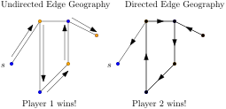
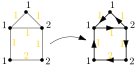
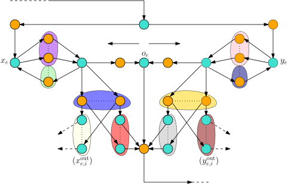
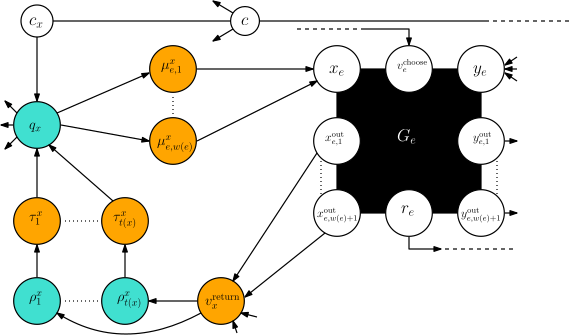
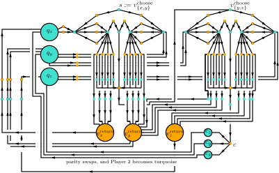
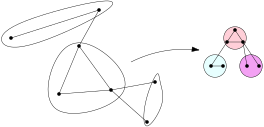
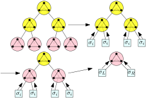
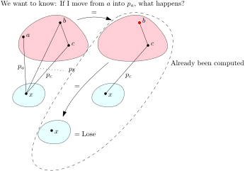

<!--
Timing: 0:15–0:20
Goal: Establish the title and one-sentence framing. Do not explain technicalities yet.
Visual TODO: Optional very faint background silhouette of a narrow graph/path decomposition.
-->

# Edge Geography is XNLP-hard for Pathwidth and in XP for Tree-Partition Width

**Thobias Kvalvik Høivik (presenting)** · **Erlend Raa Vågset**  
Western Norway University of Applied Sciences

ESA 2026 · L’Aquila

---

<!--
Timing: ~1:00
Goal: Make everyone understand the game before any complexity language appears.
Visual TODO: Create a tiny directed graph with token at s. Animate/step through: choose edge → move token → delete edge → opponent moves → no move loses.
Animation TODO: Prefer 3–4 duplicated slides in Marp rather than complex animation.
-->

## Edge Geography

A classical $\text{PSPACE}$-complete problem.

A token starts at a vertex $s$.

Players alternate:

1. choose an unused edge from the current vertex,
2. move the token along it,
3. delete that edge.

The first player unable to move loses.

---

---

## Parameterizing the problem

### Theorem (Bodlaender, modern language)

(Undirected) Edge Geography is solvable in time $f(k,d) \cdot n$ where 
$k$ is the treewidth of the graph and $d$ is the maximum 
degree of any vertex in the graph.   

Exponential time becomes "linear time" when two parameters are controlled!
What if we allow $d$ to be unbounded? 

---

---

## Our first result

### Theorem 

Directed Edge Geography is XNLP-hard parameterized by pathwidth.   

Existence of FPT algorithm would imply 
$$
  \text{FPT} = \text{W}[1] = \cdots = \text{W}[t] = \cdots
  = \text{W}[\text{SAT}] = \text{W}[\text{P}] = \text{XNLP}.
$$  
Bounded pathwidth $\Rightarrow$ bounded treewidth.
Pathwidth, and thus treewidth, is (given all reasonable assumptions) not enough!
This result transfers to Undirected Edge Geography in a simple way!

---

<!--
Timing: ~0:45
Goal: Introduce the source problem visually, not formally. Only one formula.
Visual TODO: Recreate a simple weighted graph with red vertex budgets, inspired by Figure 2. Maybe show one feasible and one infeasible orientation.
-->

## Source problem: Chosen Maximum Outdegree

Does there exist an orientation of every edge so that each vertex respects its budget.

$$
  \displaystyle \sum_{e\in\theta_\omega(v)} w(e) \leq t(v) \qquad \forall v
$$

Known to be XNLP-complete when parameterized by pathwidth.

---

<!--
Timing: ~1:30
Goal: Explain the reduction at the highest useful level. This is the most important conceptual slide.
Visual TODO: Two-phase diagram: a chain of edge gadgets, then a challenge gadget. Show Player 1 chooses sides, Player 2 later challenges one vertex.
Animation TODO: Step 1: chain only. Step 2: orientation choices. Step 3: challenge vertex. Step 4: compare outgoing weight to return paths.
-->

## Reduction idea in two phases

### Phase I — Player 1 encodes an orientation

For each input edge $e=\{x,y\}$, Player 1 chooses one of two sides.
 
$$
 \text{choose the} \ y\text{-side}
 \quad\Longleftrightarrow\quad x\to y 
$$

### Phase II — Player 2 challenges a vertex

Player 2 chooses $x$ and tests the total weight oriented out of $x$.

$$
\text{If outgoing weight} >t(x), \ 
\text{Player 2 has one excursion too many}.
$$

---

## Phase 1

---

## Phase 2

--- 
## The full reduction for a small source instance

---

<!--
Timing: ~1:00
Goal: Present correctness as a budget-counting argument. Avoid gadget details here.
Visual TODO: Two columns with yes/no source instance and who wins.
-->

## Why correctness follows

<h3>Feasible orientation</h3>

$\displaystyle \sum_{e\in\theta_\omega(x)} w(e) \leq t(x)$ for every $x$.

Player 2 eventually runs out of non-losing challenges.

Player 1 wins

<h3>Infeasible orientation</h3>

For some $x$,

$\displaystyle \sum_{e\in\theta_\omega(x)} w(e) > t(x)$.

Player 2 chooses this $x$ and survives one challenge too many.

Player 2 wins

---

<!--
Timing: ~1:00
Goal: Address the obvious concern: gadgets are large, so why does pathwidth stay small?
Visual TODO: Simplified version of Figure 6. Timeline of a path decomposition, green block where one edge gadget is active, auxiliary vertices appearing locally.
-->

## Why pathwidth is preserved

Process an input edge $e=\{x,y\}$ when $x$ and $y$ coexist in the source path decomposition.

Keep only the necessary anchors alive.

Introduce auxiliary gadget vertices locally, then forget them immediately.

$$
\operatorname{pw}(G') = O(k)
$$

---

<!--
Timing: ~0:30–0:40
Goal: Transfer directed hardness to undirected without derailing the talk.
Visual TODO: Pseudoarc replacing a directed edge. Very small and clean.
-->

## Directed to undirected

Each directed edge is replaced by a constant-size pseudoarc.

$$
u\to v \qquad\rightsquigarrow\qquad \text{undirected pseudoarc}
$$

Safe traversal works from $u$ to $v$.

Entering the wrong way is losing under optimal play.

Directed hardness transfers to Undirected Edge Geography.

---

<!--
Timing: ~1:00
Goal: Pivot from hardness to why tree partitions make an algorithm possible.
Visual TODO: Use/recreate Figure 8: graph bags on left, tree of bags on right. Highlight parent-child ports.
-->

## XP membership for width of treepartition

A rooted tree partition groups vertices into bags.

Edges are either:

- inside one bag, or
- between adjacent bags of the tree.

For width $k$, a parent-child cut has at most $k^2$ ports (on simple graphs).

  ### Theorem 

  Undirected Edge Geography $\in \text{XP}$ when parameterized by tree-partition width.

---

## Tree-partition

--- 

## A rough overview of the algorithm

---

## A solved child conveys a boolean function

---

## Child counters comprise the worst factor

### The $n$-dependent part

For fixed $k$, there are $t_k$ possible child types.

Each counter lies in $\{0,\ldots,n\}$, so

$$
m\in\{0,\ldots,n\}^{t_k}
\quad\Longrightarrow\quad
\#m\leq(n+1)^{t_k}=n^{O(t_k)}.
$$

### The other factors

Unused ports and internal edges contribute

$$
2^{k^2}\cdot2^{\binom{k}{2}}
=2^{O(k^2)}.
$$

All other boundary data depends only on $k$; collect it into $g(k)$.

$$
\underbrace{n}_{\text{bags}}
\cdot
\underbrace{g(k)}_{\text{includes }2^{O(k^2)}}
\cdot
\underbrace{n^{O(t_k)}}_{\text{counter states}}
=
n^{f(k)}.
$$

---

## Ridiculously bad in practice

Let $T_r$ be the number of ambient types on an interface with $r$ ports.

| ports $r$ | $0$ | $1$ | $2$ | $3$ | $4$ |
|:---:|:---:|:---:|:---:|:---:|:---:|
| ambient types $T_r$ | $1$ | $2$ | $676$ | $\approx 2^{768}$ | $\geq 2^{2^{4058}}$ |

Illustrative ambient count obtained by unwinding Definition 35.  
The number of realizable types may be vastly smaller.

A width-$k$ cut may have $k^2$ ports. 
The crude bound is a tower of exponentials of height $O(k^2)$.

---

<!--
Timing: ~1:00
Goal: End with the conceptual punchline and one open direction. This should be memorable.
Visual TODO: Return to the main landscape diagram, now with explanatory labels underneath.
-->

## Takeaway

<h3>Pathwidth</h3>
small separators  
uncontrolled residual history  
<strong>XNLP-hard</strong>

<h3>Tree-partition width</h3>
bounded interfaces  
residual play can be compressed  
<strong>XP</strong>

 

Is Edge Geography in XP parameterized by pathwidth alone?  
Is Edge Geography XALP-hard when parameterized by treepartition width?

